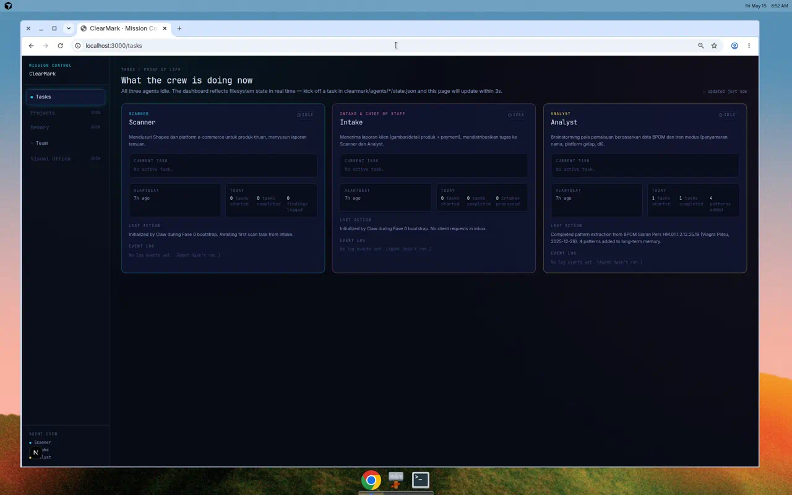
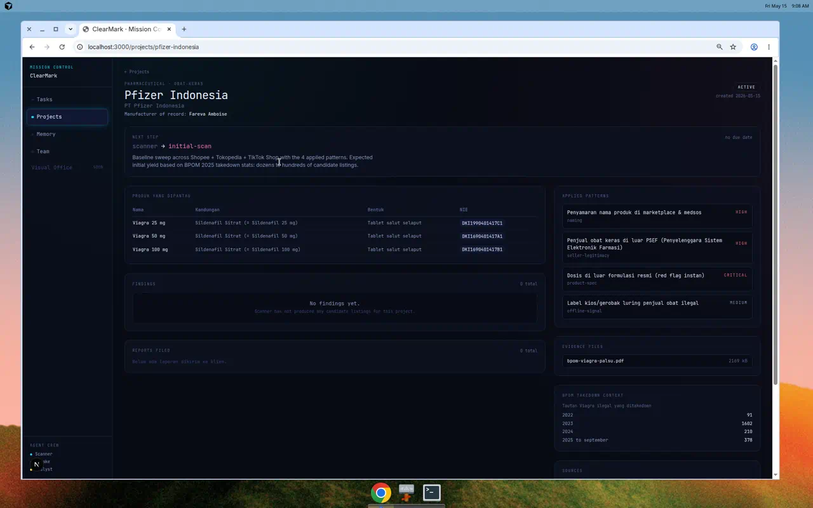
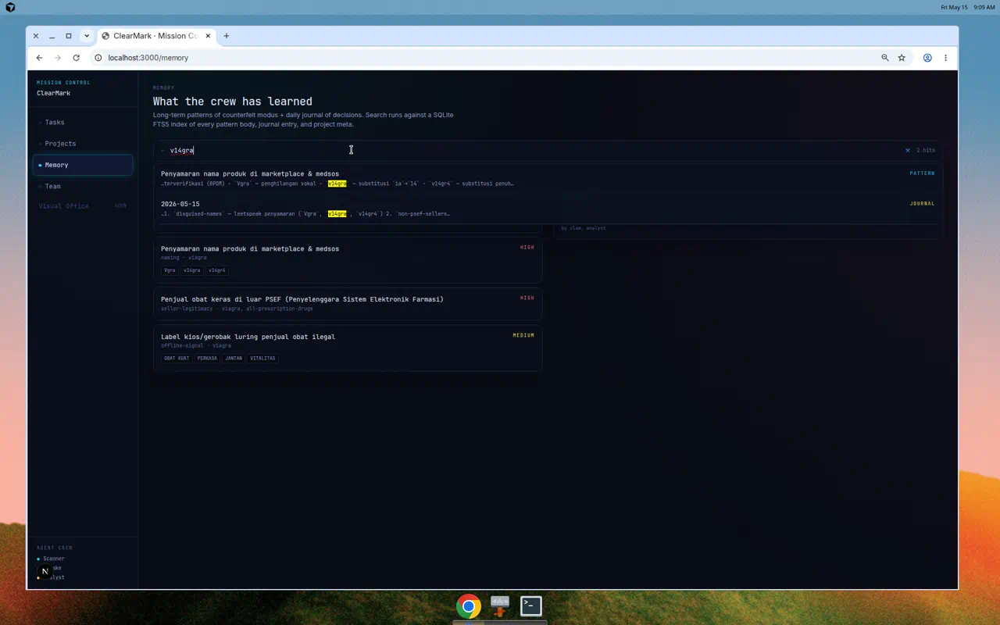
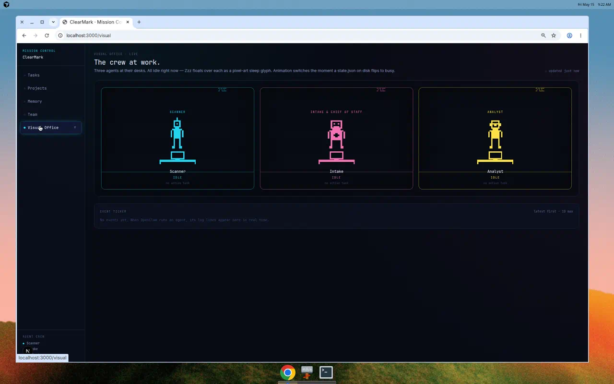

# ClearMark Mission Control

> Pemantau otomatis produk kosmetik dan obat tiruan di e-commerce Indonesia.
> Tiga agent, satu dashboard real-time, satu kontrak filesystem yang sederhana.

Submisi: **OpenClaw2026 — Muhammad Sofyan — IlegalScan**

---

## Apa ini

Brand kosmetik dan obat-obatan kehilangan pendapatan karena produk tiruan beredar bebas di Shopee, Tokopedia, TikTok Shop, dan media sosial — sementara mereka tidak punya tim untuk memantaunya. **ClearMark menggantikan tim itu**: tiga agent otomatis yang bekerja 24/7 untuk menemukan listing tiruan, menganalisis modus pemalsuan, dan menyiapkan laporan bukti siap kirim ke klien.

Sistem ini punya dua bagian yang saling melengkapi:

- **`dashboard/`** — Next.js cockpit di `localhost:3000` yang menampilkan apa yang sedang dikerjakan agent secara real-time
- **`runner/`** — CLI runtime yang menjalankan agent (Scanner / Intake / Analyst) terhadap kontrak filesystem `clearmark/`

Dashboard **mengamati**, runner **menulis**. Tidak ada API antara keduanya — keduanya bicara lewat filesystem `clearmark/`. Setiap kali runner mengubah satu file, dashboard mencerminkannya dalam satu siklus polling (≤ 3 detik).

---

## Tiga agent

| Agent | Peran | Tugas utama |
| --- | --- | --- |
| **Scanner** | Mata sistem | Menelusuri marketplace + medsos, fetch URL listing, cocokkan dengan pola pemalsuan, tulis temuan |
| **Intake** | Pintu masuk + Chief of Staff | Terima request klien dari `inbox/`, buat/match project, dispatch task ke Scanner, susun laporan akhir |
| **Analyst** | Otak sistem | Ekstrak pola dari sumber publik (BPOM siaran pers, dll), review confidence tiap temuan dari Scanner |

Tiap agent punya identitas terpisah di dashboard dengan warna aksen sendiri (Scanner cyan, Intake magenta, Analyst kuning), state.json sendiri, log harian sendiri, dan task queue sendiri.

Detail kontrak per peran ada di [`skills/clearmark-scanner/SKILL.md`](skills/clearmark-scanner/SKILL.md), [`skills/clearmark-intake/SKILL.md`](skills/clearmark-intake/SKILL.md), dan [`skills/clearmark-analyst/SKILL.md`](skills/clearmark-analyst/SKILL.md).

---

## Lima layar

### 1. Tasks — proof of life



Apa yang sedang dikerjakan tiap agent **sekarang**. Auto-polling tiap 3 detik. Setiap kartu menampilkan:

- Status pill (idle · busy · blocked) — busy berpulsa di warna aksen agent
- Current task (project, type, instructions)
- Heartbeat relatif (just now / 12s ago / 3m ago / …)
- Today's metrics (tasks started, completed, findings logged, dst — beda per agent)
- Last action (kalimat ringkasan dari agent)
- Event log tail (6 entry terbaru dari `agents/<id>/log/YYYY-MM-DD.jsonl`)

Saat ada perubahan di disk, indikator hijau di header berpulsa.

### 2. Projects — klien yang dipantau



Daftar semua project (= klien). Klik untuk drilldown:

- **Next step banner** — siapa yang harus melakukan apa selanjutnya
- **Produk yang dipantau** — tabel dengan nama, kandungan, bentuk sediaan, dan **Nomor Izin Edar (NIE)** asli BPOM inline
- **Findings** — daftar listing yang diflag Scanner (URL, platform, pola yang cocok, confidence, status)
- **Reports filed** — daftar laporan Markdown yang sudah dikirim ke klien
- **Applied patterns** (aside) — pola yang dipakai project ini, link ke pattern detail
- **Evidence files** (aside) — file bukti (PDF, screenshot) di-serve via `/api/evidence` dengan path-containment check
- **BPOM takedown context** (aside) — stats historis untuk konteks
- **Sources** + **Legal basis** — sumber dokumentasi + dasar hukum

### 3. Memory — apa yang sudah dipelajari



Dua jenis ingatan:

- **Patterns** (long-term) — pola modus pemalsuan yang sudah ditemukan, diurutkan menurut severity, dengan keywords chip preview. Tiap pattern punya halaman detail sendiri (`/memory/patterns/[slug]`) dengan markdown body + aside terstruktur (brands, platforms, keywords, regex hints, detection signals, confidence, source citation dengan link ke evidence file).
- **Journal** (daily) — jurnal harian Analyst & decisions, satu file per hari (`memory/journal/YYYY-MM-DD.md`). Detail page render markdown lengkap.

**Search** memakai SQLite FTS5 (porter + unicode61 tokenizer) lintas tiga sumber: patterns, journal, projects. Hit di-highlight dengan `<mark>`. Index di-rebuild dari filesystem kapan saja via `npm run index`.

### 4. Team

Tiga kartu profil — Scanner / Intake / Analyst. Mission statement, status pill, last action, metrics hari ini, heartbeat. Halaman ini SSR (tidak polling), karena Team page lebih ke "identitas crew", bukan operasi live.

### 5. Visual Office — pixel-art 2D



Kantor virtual front-facing. Scanner kiri (cyan), Intake tengah (magenta), Analyst kanan (kuning). Tiap ruang punya neon border, garis lantai, monitor, desk, dan karakter pixel-art:

- **Idle**: karakter berdiri santai, monitor redup, "Zzz" floating glyph di atas (animasi `floatZ`), nafas halus (`breath`)
- **Busy**: pose tangan terangkat, monitor pulse glow di accent color, 3 SPARK glyph emit ke atas (staggered 0/0.5/1s), head-bob (`bob`), label task aktif muncul di bawah nama

Polling sama seperti Tasks (3 detik). Pure SVG + CSS keyframes, tidak ada canvas / library / asset binary.

Event ticker di bawah kantor menggabungkan log dari tiga agent (latest first, 10 max), tiap baris diwarnai sesuai agent yang emit.

---

## Cara kerja end-to-end

Alur sebuah request klien dari masuk sampai jadi laporan:

```
                                                            ┌──────────────────┐
  ┌──────────────────────┐                                  │  Dashboard       │
  │ inbox/<id>.json      │                                  │  /tasks (3s poll)│
  │  (drop file di sini) │                                  └────────▲─────────┘
  └─────────┬────────────┘                                           │
            │                                                        │ baca state + log
            ▼                                                        │
  ┌─────────────────────┐    writeTask(scanner)    ┌──────────────────────────┐
  │  Intake             │ ─────────────────────▶   │ agents/scanner/tasks/    │
  │  • create/match     │                          │   task-YYYY-MM-DD-xx.json│
  │    project          │                          └──────────┬───────────────┘
  │  • archive inbox    │                                     │
  └──────────┬──────────┘                                     ▼
             │                                       ┌─────────────────────┐
             │                                       │  Scanner            │
             │                                       │  • httpGet(url)     │
             │                                       │  • match patterns   │
             │                                       │  • write finding    │
             │                                       └──────────┬──────────┘
             │                                                  │
             │                                                  ▼
             │                                  ┌─────────────────────────────────┐
             │                                  │ projects/<slug>/findings/       │
             │                                  │   YYYY-MM-DD-xx.json status:new │
             │                                  └──────────┬──────────────────────┘
             │                                             │
             │                                             ▼
             │                                       ┌─────────────────────┐
             │                                       │  Analyst            │
             │                                       │  • applyRules()     │
             │                                       │  • set confidence   │
             │                                       │  • verdict + notes  │
             │                                       └──────────┬──────────┘
             │                                                  │
             │                                                  ▼ (high-conf)
             │                                  ┌─────────────────────────────────┐
             └──────────────────────────────────┤ next_step → 'compose-report'    │
                                                └──────────┬──────────────────────┘
                                                           ▼
                                            ┌─────────────────────────┐
                                            │ projects/<slug>/reports/│
                                            │   YYYY-MM-DD-xx.md      │
                                            └─────────────────────────┘
```

Setiap state transition di runner heartbeats `agents/<id>/state.json` dan menulis baris JSONL ke `agents/<id>/log/YYYY-MM-DD.jsonl`. Dashboard polling melihat perubahan dalam 3 detik.

Detail tiap tick: [`runner/README.md`](runner/README.md).

---

## Quick start

### 1. Dashboard saja (read-only view)

```bash
cd dashboard
npm install
npm run index   # build clearmark/.index.db (SQLite FTS5) dari filesystem
npm run dev     # http://localhost:3000 → otomatis redirect ke /tasks
```

Dashboard cukup dengan workspace dalam state idle (default seed sudah berisi 1 project Pfizer + 4 pola BPOM + 1 journal entry).

### 2. Runner saja (kalau cuma mau eksekusi agent dari CLI)

```bash
cd runner
npm install

# tick sekali per agent
npm run run:intake
npm run run:scanner
npm run run:analyst

# atau ketiganya berurutan
npm run run:all

# atau loop terus (Ctrl+C berhenti)
npx tsx src/cli.ts scanner --loop 30
```

### 3. End-to-end demo (dashboard + runner)

Jalankan `dashboard` dulu (terminal 1). Lalu di terminal 2:

```bash
# drop sample inbox file
cp runner/examples/inbox-sample.json clearmark/inbox/demo-001.json

# proses end-to-end
cd runner
npm run run:intake     # Intake match project → dispatch scanner task
npm run run:scanner    # Scanner fetch URLs → match patterns → tulis finding
npm run run:analyst    # Analyst review confidence + verdict
```

Buka `http://localhost:3000/tasks` — lihat tiap agent flip busy lalu idle dengan log nyata. Klik `/projects/pfizer-indonesia` — finding baru muncul dengan platform, pattern, confidence pill, status.

---

## Repo layout

```
/
├── README.md                       ← anda di sini
├── AGENTS.md                       ← konvensi workspace OpenClaw
├── IDENTITY.md                     ← identitas co-pilot (Claw)
├── USER.md                         ← konteks human (Muhammad Sofyan)
├── SOUL.md  TOOLS.md  HEARTBEAT.md ← konvensi OpenClaw lainnya
│
├── clearmark/                      ← source of truth, source of fact
│   ├── projects/<slug>/
│   │   ├── project.json            ← meta klien + produk + applied patterns + stats
│   │   ├── findings/*.json         ← satu file per listing yang diflag Scanner
│   │   ├── reports/*.md            ← laporan siap kirim ke klien
│   │   └── evidence/*              ← PDF/screenshot bukti
│   ├── agents/{scanner,intake,analyst}/
│   │   ├── state.json              ← status idle/busy/blocked + last action + metrics
│   │   ├── tasks/*.json            ← task queue (di-claim runner saat tick)
│   │   └── log/YYYY-MM-DD.jsonl    ← event log append-only
│   ├── memory/
│   │   ├── journal/YYYY-MM-DD.md   ← jurnal harian Analyst
│   │   └── patterns/<slug>.md      ← long-term pattern entries (frontmatter + body)
│   ├── inbox/*.json                ← request klien (drop file di sini)
│   └── .index.db                   ← derived SQLite FTS5 (gitignored, rebuild-able)
│
├── dashboard/                      ← Next.js 15 mission control UI
│   ├── app/(dashboard)/{tasks,projects,memory,team,visual}/
│   ├── app/api/{agents,tasks,search,evidence}/
│   ├── components/                 ← Sidebar, AgentCard, StatusPill, Markdown, SearchBar, …
│   ├── lib/clearmark.ts            ← filesystem reader (typed)
│   ├── lib/db.ts                   ← SQLite FTS5 indexer + searcher
│   ├── scripts/build-index.ts      ← CLI rebuild dengan --watch
│   └── README.md                   ← per-dashboard usage
│
├── runner/                         ← OpenClaw runtime untuk 3 agent
│   ├── src/cli.ts                  ← entry: tsx src/cli.ts <agent> [--loop <s>]
│   ├── src/agents/{intake,scanner,analyst}.ts
│   ├── src/{state,tasks,patterns,matching,fetch,text,paths,ids}.ts
│   ├── examples/inbox-sample.json  ← template request klien
│   └── README.md                   ← per-runner usage + cron wiring
│
├── skills/                         ← kontrak per agent (dibaca runner & operator manusia)
│   ├── clearmark-scanner/SKILL.md
│   ├── clearmark-intake/SKILL.md
│   └── clearmark-analyst/SKILL.md
│
└── docs/screenshots/               ← gambar yang dipakai README ini
```

---

## Data contract (`clearmark/`)

Satu prinsip: **filesystem adalah source of truth**. SQLite hanya derived index untuk search, aman dihapus dan rebuild kapan saja. Tidak ada database lain. Dashboard tidak menulis ke `clearmark/`, hanya runner yang menulis. Operator manusia boleh menulis langsung (drop inbox JSON, edit pattern .md) — runner dan dashboard ikut.

| File / Folder | Penulis | Pembaca | Lifecycle |
| --- | --- | --- | --- |
| `clearmark/inbox/<id>.json` | Operator manusia | Intake | Drop → diarsipkan ke `inbox/processed/` |
| `clearmark/projects/<slug>/project.json` | Intake (create) · Scanner (stats) · Analyst (high-conf count) | Dashboard | Hidup selama klien aktif |
| `clearmark/projects/<slug>/findings/*.json` | Scanner (create) · Analyst (review) | Dashboard · Intake (untuk report) | new → confirmed / dismissed |
| `clearmark/projects/<slug>/reports/*.md` | Intake | Dashboard · Klien (kirim manual) | Append-only |
| `clearmark/projects/<slug>/evidence/*` | Operator · Scanner | Dashboard (`/api/evidence`) | Append-only |
| `clearmark/agents/<id>/state.json` | Runner | Dashboard | Selalu satu file, overwrite per heartbeat |
| `clearmark/agents/<id>/tasks/*.json` | Intake (write) · Scanner/Analyst (claim) | Runner | Dibuat oleh Intake, dihapus runner saat selesai |
| `clearmark/agents/<id>/log/YYYY-MM-DD.jsonl` | Runner | Dashboard | Append-only, satu file per hari |
| `clearmark/memory/journal/YYYY-MM-DD.md` | Analyst · Operator | Dashboard · Search index | Append-only |
| `clearmark/memory/patterns/<slug>.md` | Operator (curate) | Scanner · Analyst · Dashboard | Hidup selamanya, jarang berubah |
| `clearmark/.index.db` | `npm run index` | Dashboard (`/api/search`) | Derived, gitignored |

---

## Tech stack

| Layer | Pilihan | Alasan |
| --- | --- | --- |
| UI | **Next.js 15 (App Router)** + **React 19** + **Tailwind 3.4** | App Router untuk SSR per route, Tailwind untuk velocity, shadcn-style design tokens custom |
| State storage | **Filesystem (JSON + Markdown frontmatter)** + **SQLite FTS5** sebagai derived index | Sesuai konvensi OpenClaw, file-first; SQLite hanya untuk full-text search |
| Markdown | **react-markdown** + **remark-gfm** + **gray-matter** | Render journal & pattern body, parse frontmatter |
| Runner | **TypeScript** + **tsx** (ESM, strict) | Native Node 22 fetch, no compile step, deps minimal (16 packages) |
| Index | **better-sqlite3 11** + **FTS5** (porter + unicode61) | Sync API → simple Node integration, FTS5 untuk search Indonesia/English mixed |
| Pattern matching | Native **JavaScript RegExp** + keyword includes | Deterministic, no LLM. PCRE-style `(?i)` inline flags dipromosikan ke flag JS otomatis |

---

## Seed data

Bukan mock. Diambil dari **BPOM Siaran Pers HM.01.1.2.12.25.19 (29 Desember 2025)**, "Informasi Detil Produk Obat Palsu VIAGRA" — dokumen publik yang sudah ditandatangani secara elektronik oleh BSrE.

- **1 project**: `pfizer-indonesia` (Pfizer Indonesia / Fareva Amboise) — reference target, belum klien berbayar
- **3 produk** dengan NIE asli: Viagra 25 mg `DKI1990401417C1`, 50 mg `DKI1690401417A1`, 100 mg `DKI1690401417B1`
- **4 pola pemalsuan** yang ditemukan BPOM, di-encode sebagai pattern entries:
  - `disguised-names` — leetspeak penyamaran nama (`Vgra`, `v14gra`, `v14gr4`)
  - `non-psef-sellers` — penjual obat keras di luar PSEF resmi (filter volume terbesar)
  - `impossible-dosage` — dosis 500/800/1000 mg (asli hanya 25/50/100 mg) → flag pasti palsu
  - `kios-labels` — papan nama "OBAT KUAT / PERKASA / JANTAN / VITALITAS"
- **PDF sumber** disimpan di `clearmark/projects/pfizer-indonesia/evidence/bpom-viagra-palsu.pdf` dan di-serve via `/api/evidence`
- **Context stats** BPOM takedown: 2022 = 91 tautan, 2023 = 1602, 2024 = 210, 2025 (s.d. Sept) = 378
- **Dasar hukum** terdokumentasi: UU 17/2023 Pasal 435 jo. 138(2)(3), UU 17/2023 Pasal 436 jo. 145(1), UU 8/1999 Pasal 62(1)
- **Day-zero journal** (`memory/journal/2026-05-15.md`) — catatan jujur tentang apa yang dilakukan hari workspace dibootstrap

---

## Identitas

- **Claw 🦑** — co-pilot AI yang membangun & memelihara sistem ini. Bukan salah satu dari tiga agent.
- **Scanner / Intake / Analyst** — tiga agent yang dilacak dashboard. Mereka yang melakukan kerja sungguhan.

Pemisahan ini disengaja: Claw mengatur infrastruktur, tiga agent menjalankan operasi.

---

## Operational notes

- **Single-instance per agent.** Runner tidak pakai file lock. Jalankan dua `scanner --loop` bersamaan → race di task queue. Untuk produksi pakai cron dengan jadwal terpisah (lihat [`runner/README.md`](runner/README.md)).
- **Tick failure → `status: blocked`.** State file ditinggal di blocked dengan error di `last_action`. Operator yang clear (edit state.json kembali ke idle).
- **No findings invented.** URL tanpa pattern hit menulis `no_match` di log saja, tidak ada JSON finding palsu.
- **Per-URL failure isolated.** Network error di satu URL log `fetch_failed` dan scan lanjut ke URL berikutnya.
- **Heartbeat antar URL.** Scanner refresh `last_heartbeat` sebelum tiap fetch supaya dashboard tetap responsif saat scan panjang.
- **TLS quirk BPOM.** Host `simpan.pom.go.id` pakai DigiCert Global G2 chain yang tidak ada di beberapa container CA bundle. Kalau `fetch failed` muncul, set `NODE_EXTRA_CA_CERTS` atau jalankan di luar container. Sample inbox pakai Wikipedia/example.com biar first-run aman.

---

## Out of scope (sengaja)

- **LLM adapter.** Semua keputusan deterministik (regex + keyword + rules table). Bisa ditambah pluggable adapter nanti.
- **Source ingestion oleh Analyst.** Analyst hanya review finding existing dengan rules. Ekstraksi pola dari sumber baru (BPOM PDF baru, news article) tetap human-in-the-loop — terlalu sensitif untuk diautomate sekarang.
- **Multi-runner coordination.** Asumsi single-instance per agent. File lock + leader election bisa ditambahkan kalau scale-out diperlukan.
- **PDF body extraction di Scanner.** PDF URL kembali sebagai non-text body, runner log dan skip. `pdf-parse` bisa ditambahkan kalau target listing sering PDF.
- **Telegram / webhook notifications.** Drop di Fase 2 sesuai keputusan eksplisit. Bisa ditambahkan sebagai sidecar yang watch `findings/*.json` dengan status `confirmed`.

---

## Lisensi & atribusi

Submisi kompetisi OpenClaw2026. Tidak ada lisensi terbuka yang ditetapkan saat ini.

Sumber data publik:

- BPOM Siaran Pers HM.01.1.2.12.25.19 — "Informasi Detil Produk Obat Palsu Viagra" (29 Desember 2025). Diakses publik dari `simpan.pom.go.id`. Disimpan sebagai evidence project Pfizer.

Inspirasi visual: layout "Visual Office" terinspirasi dari mission control pixel-art ala Tina Huang ("Inky Online"), diadaptasi dengan palet ClearMark sendiri.

---

## Lihat juga

- [`dashboard/README.md`](dashboard/README.md) — Next.js usage, scripts, dev server
- [`runner/README.md`](runner/README.md) — runner usage, inbox JSON shape, cron wiring
- [`skills/clearmark-scanner/SKILL.md`](skills/clearmark-scanner/SKILL.md) — kontrak Scanner
- [`skills/clearmark-intake/SKILL.md`](skills/clearmark-intake/SKILL.md) — kontrak Intake
- [`skills/clearmark-analyst/SKILL.md`](skills/clearmark-analyst/SKILL.md) — kontrak Analyst
